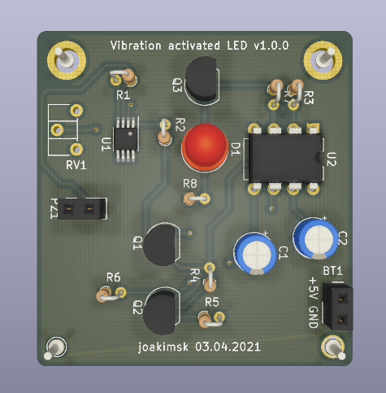
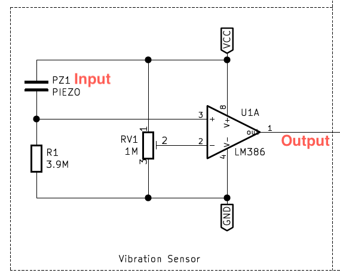
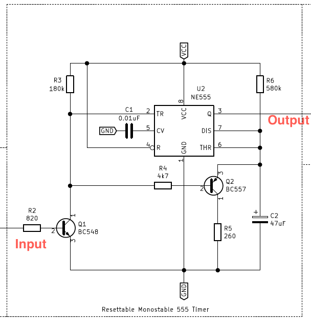
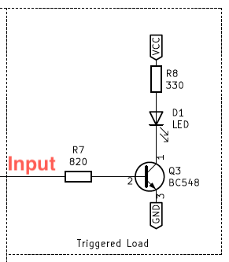

# Vibration activated trigger

We use a Piezoelectric element with an operational amplifier to detect small movements. Sensitivity is controlled with potentiometer RV1.

A monostable 555-timer gets triggered, and can be continuously reset, to maintain stable output signal.

The output signal is in this case, driving a LED, but could be used to activate external devices, for example, the purpose of which this was made, an off-the-shelf GPS tracker.

Schematic as PDF available [here](./renders/full_circuit.pdf)

Circuit consists of three components, which I try to explain here.

Latest revision 1.0.0 (first complete prototype).

## Component: Trigger
The high voltage generated when a piezoelectric crystal is exposed to mechanical load, is compared using LM386 operational amplifier (Voltage Comparator configuration), to an adjustable reference voltage up to VCC (+5v).

## Component: Monostable 555
The trigger signal from last component is used to reset a monostable 555 timer. It should toggle output high and take roughly 30 seconds due to size of R6 and C2 before output is low. It is resettable, by activating Q2, which drains C2 when triggered. This means the output signal will be stable, and can be kept high under prolonged vibrations.

## Component: Load
The load is a placeholder for your important equipment. In this example, Q3 turns on LED D1 when input signal is high. Feel free to replace this component with whatever you want to turn on. This is supposed to turn on power to an off-the-shelf GPS tracker.

## Reason
I wanted to track small boats using battery power. The vibration from the outboard engine would activate the GPS tracker, and keep it running while the boat is moving, but turn off when it is standing still. There is a bit of power consumption when disabled, but much less than keeping the GPS running all the time.

## Future work
- Make this all with SMD components.
- Do a better job on the routing.
- Find/make a nice casing.
- Find better connectors.
- Choose more suitable components (trimpot, low power components, 3.3v etc).
- Maybe do some calculations on power consumption.